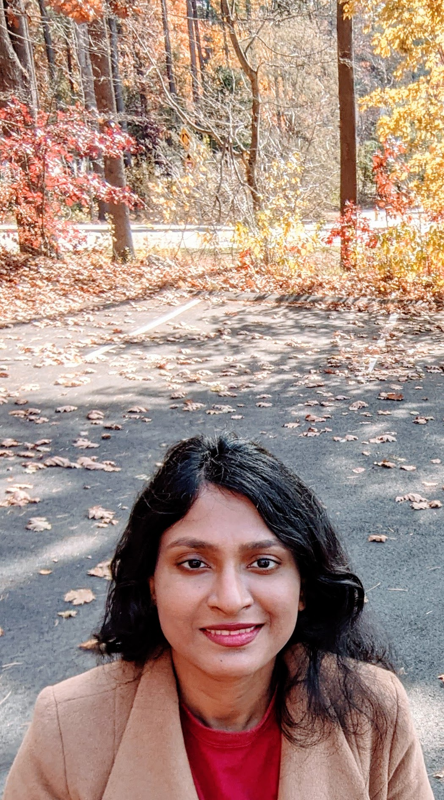

I am a research scientist at the [Machine Learning Research Group, Oracle Labs](https://labs.oracle.com/pls/apex/f?p=labs:49:::::P49_PROJECT_ID:7). Previously, I received a Ph.D. in Computer Science from [Vanderbilt University](https://engineering.vanderbilt.edu/eecs/), where I was advised by [Yevgeniy Vorobeychik](http://vorobeychik.com/). I graduated with B.Tech. in Electrical Engineering from [Indian Institute of Technology, Kharagpur](http://www.iitkgp.ac.in/department/EE). I interned at Apple Inc. in 2017 and at  [Max Planck Institute<\span>](https://www.mpi-magdeburg.mpg.de/csc) in 2011.

My research interests span algorithmic fairness, machine learning, stochastic planning and computational game theory. 

