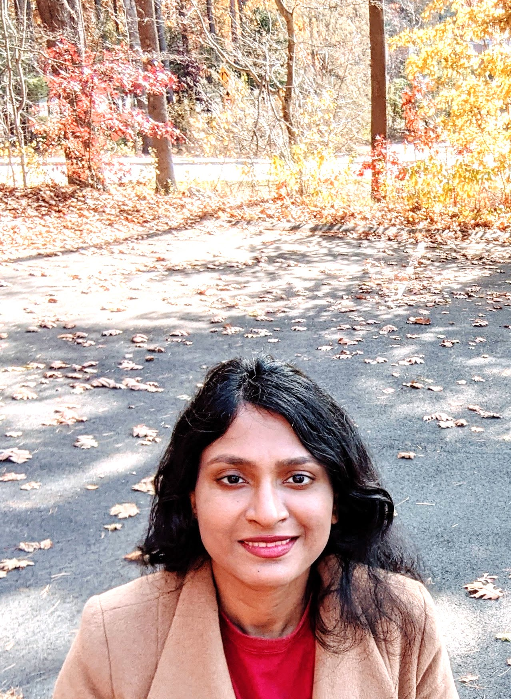

I am a research scientist at the [Machine Learning Research Group, Oracle Labs](https://labs.oracle.com/pls/apex/f?p=labs:49:::::P49_PROJECT_ID:7). Previously, I received a Ph.D. in Computer Science from [Vanderbilt University](https://engineering.vanderbilt.edu/eecs/), where I was advised by [Yevgeniy Vorobeychik](http://vorobeychik.com/).
I graduated with B.Tech. in Electrical Engineering from [Indian Institute of Technology, Kharagpur](http://www.iitkgp.ac.in/department/EE). I interned at Apple Inc. in 2017 and at  [Max Planck Institute](https://www.mpi-magdeburg.mpg.de/csc) in 2011.

My research interests span algorithmic fairness, machine learning, stochastic planning and computational game theory. 

# Publications

* <b>Online Post-Processing In Rankings For Fair Utility Maximization.</b> Ananya Gupta, Eric Johnson, Justin Payan, Aditya Roy, Ari Kobren, Swetasudha Panda, Michael Wick, Jean-Baptiste Tristan. The 14th ACM International Conference On Web Search And Data Mining <b>(WSDM'21)</b>. [PDF] [BibTex] 
* <b>Fair Online Post-Processing for Black-Box ML Screening Systems.</b>Swetasudha Panda, Ari Kobren, Michael Wick, Jean-Baptiste Tristan.<b>NeurIPS'20 </b> Women in Machine Learning Workshop. 
* <b>Unlocking Fairness: A Trade-off Revisited.</b><b>NeurIPS'19 </b> [[PDF]](https://papers.nips.cc/paper/9082-unlocking-fairness-a-trade-off-revisited.pdf) Michael L. Wick, Swetasudha Panda,Jean-Baptiste Tristan.  
*<b>Using Bayes Factors To Control For Fairness: Case Study On Learning To Rank.</b> <b> NeurIPS'19</b>  Workshop on Robust AI in Financial Services: Data, Fairness, Explainability, Trustworthiness, and Privacy.
Swetasudha Panda, Jean-Baptiste Tristan, Michael Wick, Haniyeh Mahmoudian and Pallika Kanani.
* Scaling Hierarchical Coreference With Homomorphic Compression.<b>AKBC'19 </b>  Michael L. Wick, Swetasudha Panda, Joseph Tassarotti, Jean-Baptiste Tristan.
* Game theoretic antibody design. <b> AAMAS'19</b>  
Workshop on AI for Social Good.
Swetasudha Panda, Alexander M. Sevy, James E. Crowe Jr, Jens Meiler and Yevgeniy Vorobeychik.
* Scalable initial state interdiction for factored MDPs.<b> NeurIPS'18</b>  
Women in Machine Learning Workshop. 
Swetasudha Panda.
* Scalable initial state interdiction for factored MDPs.<b>IJCAI'18</b>  
 Swetasudha Panda and Yevgeniy Vorobeychik.
* Integrating machine learning with structural modeling to increase HIV neutralization breadth.<b> PLOS CompBio'18</b>  
Swetasudha Panda, Alexander M. Sevy, James E. Crowe, Jr, Jens Meiler, Yevgeniy Vorobeychik.
* Near-optimal interdiction of factored MDPs. <b>UAI'17</b>  
Swetasudha Panda and Yevgeniy Vorobeychik.
* Stackelberg games for vaccine design. <b>AAMAS'15</b>  
Swetasudha Panda and Yevgeniy Vorobeychik.
* Stackelberg games for antibody design.<b> AAAI'15 </b>   
Spring Symposium on Applied Computational Game Theory. 
Swetasudha Panda and Yevgeniy Vorobeychik.
* Designing vaccines that are robust to virus escape.<b>AAAI'15</b>  
Swetasudha Panda and Yevgeniy Vorobeychik.
* Robust optic nerve segmentation on clinically acquired CT. <b>SPIE'14</b>  
Swetasudha Panda, Andrew J. Asman, Michael P. DeLisi, Louise A. Mawn, Robert L. Galloway,
Bennett A. Landman.
* Evaluation of multi-atlas label fusion for MRI orbital segmentation. <b> JMI'14</b>  
Swetasudha Panda, Andrew J. Asman, Shweta P. Khare, Lindsey Thompson, Louise A. Mawn, Seth
A. Smith, Bennett A. Landman.
* Robust optic nerve segmentation on clinically acquired CT.<b> JMI'14</b>  
Swetasudha Panda, Robert A. Harrigan, Andrew J. Asman, Michael P. DeLisi, Benjamin C. W.
Yvernault, Robert L. Galloway, Louise A. Mawn, Bennett A. Landman.
* Regression forest region recognition enhances multi-atlas spleen labeling.  <b>MICCAI'13</b>  Challenge Workshop on Segmentation: Algorithms, Theory and Applications. 
Bo Li, Swetasudha Panda, Zhoubing Xu, Andrew J. Asman, Peter L. Shanahan, Richard G. Abramson,
Bennett A. Landman.

