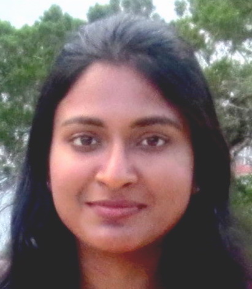

I am a research scientist at [Oracle Labs, Machine Learning Research Group](https://labs.oracle.com/pls/apex/f?p=labs:49:::::P49_PROJECT_ID:7).  Previously, I received a Ph.D. in Computer Science from [Vanderbilt University](https://engineering.vanderbilt.edu/eecs/), where I was advised by Professor [Yevgeniy Vorobeychik](http://vorobeychik.com/). I graduated with B.Tech. in Electrical Engineering from [Indian Institute of Technology, Kharagpur](http://www.iitkgp.ac.in/).

My current research is on machine learning and algorithmic fairness. My research interests span computational game theory, stochastic planning, machine learning and artificial intelligence.

For more information, please refer to my [CV](http://swetapanda.github.io/files/CV_Sweta_Panda.pdf). 

