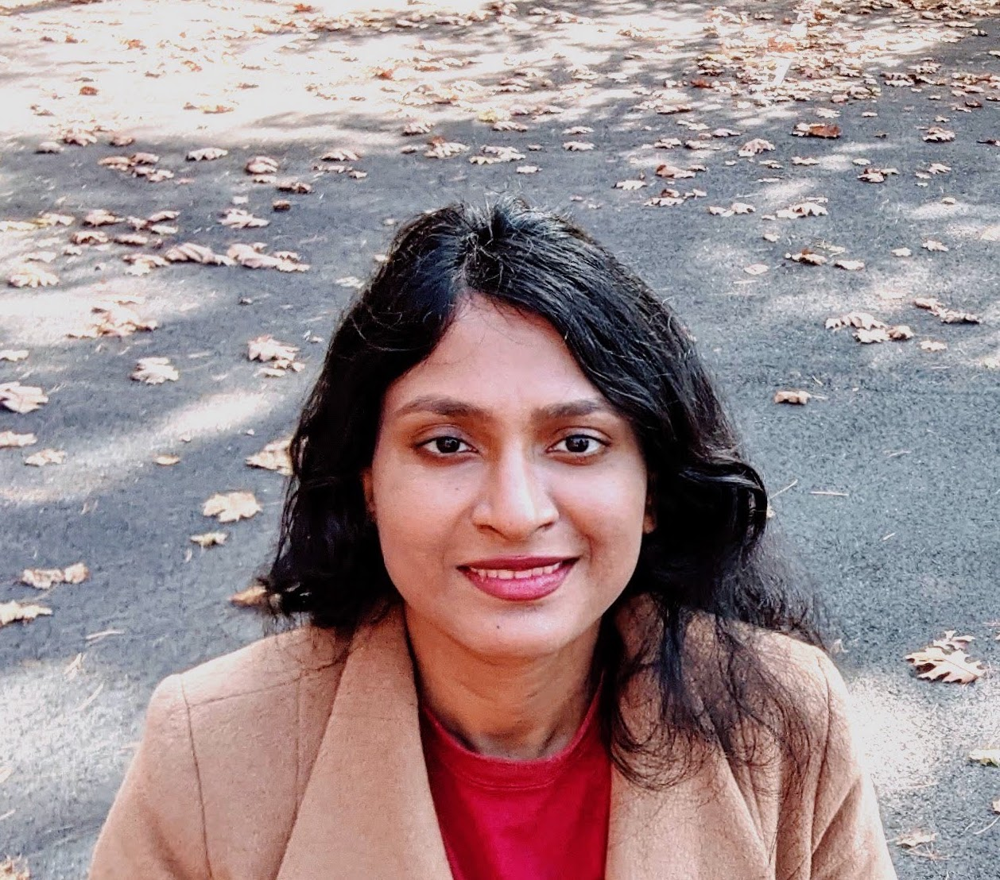

I am a research scientist at the [<b>Machine Learning Research Group, Oracle Labs</b>](https://labs.oracle.com/pls/apex/f?p=labs:49:::::P49_PROJECT_ID:7). 

 Previously, I received a Ph.D. in Computer Science from [<b>Vanderbilt University</b>](https://engineering.vanderbilt.edu/eecs/), where I was advised by [<b>Yevgeniy Vorobeychik</b>](http://vorobeychik.com/).
I graduated with B.Tech. in Electrical Engineering from [<b>Indian Institute of Technology, Kharagpur</b>](http://www.iitkgp.ac.in/department/EE). I interned at Apple Inc. during summer 2017 and at  [<b>Max Planck Institute</b>](https://www.mpi-magdeburg.mpg.de/csc) during summer 2011. My research interests span fairness-aware machine learning and natural language processing, stochastic planning and computational game theory.

# Publications

* 
<b>Don’t Just Clean It, Proxy Clean It: Mitigating Bias by Proxy in Pre-Trained Models.</b> Swetasudha Panda, Ari Kobren, Michael Wick, Qinlan Shen. Empirical Methods in Natural Language Processing <b>(EMNLP 2022) Findings Track</b>. <a href="http://swetapanda.github.io/menu/EMNLP2022_Submission-17.pdf">[<b>PDF</b>]</a><a href="https://aclanthology.org/2022.findings-emnlp.372/">[<b>BibTex</b>]</a> 
 
* 
<b>Upstream Mitigation Is Not All You Need: Testing the Bias Transfer Hypothesis in Pre-Trained Language Models.</b> Ryan Steed, Swetasudha Panda, Ari Kobren, Michael Wick. Association for Computational Linguistics <b>(ACL 2022)</b>. <a href="https://aclanthology.org/2022.acl-long.247/">[<b>PDF</b>]</a><a href="https://aclanthology.org/2022.acl-long.247.bib">[<b>BibTex</b>]</a> 
 
* 
<b>Debiasing Pre-Trained Sentence Encoders with Word Dropout.</b>  Swetasudha Panda, Michael Wick, Ari Kobren.  NeurIPS Data-Centric AI Workshop <b>(DCAI 2021)</b>. 
 
* 
<b>Online Post-Processing In Rankings For Fair Utility Maximization.</b> Ananya Gupta, Eric Johnson, Justin Payan, Aditya Roy, Ari Kobren, Swetasudha Panda, Michael Wick, Jean-Baptiste Tristan.  Web Search And Data Mining <b>(WSDM 2021)</b>. <a href="http://swetapanda.github.io/menu/fairranking.pdf">[<b>PDF</b>]</a><a href="https://scholar.googleusercontent.com/scholar.bib?q=info:BlrOQ8593MQJ:scholar.google.com/&output=citation&scisdr=CgUIgGq5EJSw0gjKJu8:AAGBfm0AAAAAYofMPu80j7LLY-8C8-wz4m10Lj8naW8P&scisig=AAGBfm0AAAAAYofMPiGM_I3LZ3WFJ-XSir-tqTkjYHWr&scisf=4&ct=citation&cd=-1&hl=en&scfhb=1">[<b>BibTex</b>]</a> 
 
* 
<b>Fair Online Post-Processing For Black-Box ML Screening Systems.</b> Swetasudha Panda, Ari Kobren, Michael Wick, Jean-Baptiste Tristan.  Women In Machine Learning Workshop <b>(WiML 2020)</b>.<a href="http://swetapanda.github.io/menu/WiML20.pdf"> [<b>Poster</b>]</a>
 
* 
<b>Unlocking Fairness: A Trade-off Revisited.</b>  Michael L. Wick, Swetasudha Panda,Jean-Baptiste Tristan.  Neural Information Processing Systems <b>(NeurIPS 2019)</b>. 
 <a href="https://papers.nips.cc/paper/9082-unlocking-fairness-a-trade-off-revisited.pdf">[<b>PDF</b>]</a> <a href="https://scholar.googleusercontent.com/scholar.bib?q=info:fAn5SWrc2QwJ:scholar.google.com/&output=citation&scisdr=CgUIgGq5EJSw0gjKCeM:AAGBfm0AAAAAYofMEeOgnKyGOsOZbl2qz3cV1zownr_x&scisig=AAGBfm0AAAAAYofMER0rvujxdVdUyhdwg9k2MOruJP68&scisf=4&ct=citation&cd=-1&hl=en&scfhb=1">[<b>BibTex</b>]</a>
 
* 
<b>Using Bayes Factors To Control For Fairness: Case Study On Learning To Rank.</b>  Swetasudha Panda, Jean-Baptiste Tristan, Michael Wick, Haniyeh Mahmoudian and Pallika Kanani.  NeurIPS 2019 Workshop on Robust AI in Financial Services: Data, Fairness, Explainability, Trustworthiness, and Privacy <b>(Robust AI in FS 2019)</b>. <a href="http://swetapanda.github.io/menu/robust19.pdf">[<b>PDF</b>]</a>
 
* 
<b>Scaling Hierarchical Coreference With Homomorphic Compression.</b>  Michael L. Wick, Swetasudha Panda, Joseph Tassarotti, Jean-Baptiste Tristan.  Automated Knowledge Base Construction <b>(AKBC 2019)</b>. <a href="https://openreview.net/pdf?id=H1gwRx5T6Q">[<b>PDF</b>]</a><a href="https://scholar.googleusercontent.com/scholar.bib?q=info:kbcVVLoG6B0J:scholar.google.com/&output=citation&scisdr=CgWZQekoEJSw0gjU-Yo:AAGBfm0AAAAAYofS4Ypt2SFL2TRtwEdYJD_H8hRBu8Vo&scisig=AAGBfm0AAAAAYofS4U82gz7hxlO6iwHoOazJPyxqUzRr&scisf=4&ct=citation&cd=-1&hl=en&scfhb=1">[<b>BibTex</b>]</a>
 
* 
<b>Game Theoretic Antibody Design.</b>  Swetasudha Panda, Alexander M. Sevy, James E. Crowe Jr, Jens Meiler and Yevgeniy Vorobeychik.
 Joint Workshop on 
Autonomous Agents for Social Good <b>(AASG 2019)</b>.
 <a href="http://swetapanda.github.io/menu/Game_theory_ab_design.pdf">[<b>PDF</b>]</a> <a href="http://swetapanda.github.io/menu/AASG_Sweta_Panda.pdf">[<b>Talk</b>]</a>
 
* 
<b>Scalable Initial State Interdiction For Factored MDPs.</b>  Swetasudha Panda.  Women In Machine Learning Workshop <b>(WiML 2018)</b>.
 
* 
<b>Algorithms For Large Scale Adversarial Decision Problems.</b>  Swetasudha Panda. Ph.D. Dissertation. 
 
* 
<b>Scalable Initial State Interdiction For Factored MDPs.</b>  Swetasudha Panda and Yevgeniy Vorobeychik.  International Joint Conference on Artificial Intelligence <b>(IJCAI 2018)</b>. <a href="https://www.ijcai.org/proceedings/2018/0667.pdf">[<b>PDF</b>]</a><a href="https://scholar.googleusercontent.com/scholar.bib?q=info:uvay10AkKTMJ:scholar.google.com/&output=citation&scisdr=CgWZQekoEJSw0gjSE9I:AAGBfm0AAAAAYofUC9I3GA2BTvfspSUmK43PVedOsrfi&scisig=AAGBfm0AAAAAYofUC7F-lf8ca2hPlGeYAx5C1flVFwgo&scisf=4&ct=citation&cd=-1&hl=en&scfhb=1">[<b>BibTex</b>]</a>
 
* 
<b>Integrating Machine Learning With Structural Modeling To Increase HIV Neutralization Breadth.</b>  Swetasudha Panda, Alexander M. Sevy, James E. Crowe, Jr, Jens Meiler, Yevgeniy Vorobeychik.  PLOS Computational Biology Journal<b> (PLOS CompBio 2018)</b>. <a href="https://journals.plos.org/ploscompbiol/article/file?id=10.1371/journal.pcbi.1005999&type=printable">[<b>PDF</b>]</a><a href="https://scholar.googleusercontent.com/scholar.bib?q=info:Tap6WoW2jw8J:scholar.google.com/&output=citation&scisdr=CgUIgGq5EJSw0gjNb3k:AAGBfm0AAAAAYofLd3kVewU1_yRyRZtRMKbj-pZflDKl&scisig=AAGBfm0AAAAAYofLd1B4HaR9DFkKqzeaP0bFr2Z89BxU&scisf=4&ct=citation&cd=-1&hl=en&scfhb=1">[<b>BibTex</b>]</a>
 
* 
<b>Near-optimal Interdiction Of Factored MDPs.</b>  Swetasudha Panda and Yevgeniy Vorobeychik.  Uncertainty in Artificial Intelligence <b>(UAI 2017)</b>. <a href="http://www.auai.org/uai2017/proceedings/papers/62.pdf">[<b>PDF</b>]</a><a href="https://scholar.googleusercontent.com/scholar.bib?q=info:yj1XI_-XVfsJ:scholar.google.com/&output=citation&scisdr=CgUIgGq5EJSw0gjMbK8:AAGBfm0AAAAAYofKdK-W-wxr0R0Qtxt_YlkcmZ31YosW&scisig=AAGBfm0AAAAAYofKdMjCsrfqKsOvVSTehjZ_-WDRAFqa&scisf=4&ct=citation&cd=-1&hl=en&scfhb=1">[<b>BibTex</b>]</a> 
 
* 
<b>Stackelberg Games For Vaccine Design.</b>  Swetasudha Panda and Yevgeniy Vorobeychik.  Autonomous Agents and MultiAgent Systems <b>(AAMAS 2015)</b>. <a href="http://www.vorobeychik.com/2015/abdesign.pdf">[<b>PDF</b>]</a><a href="https://scholar.googleusercontent.com/scholar.bib?q=info:FbvxWk9XFBUJ:scholar.google.com/&output=citation&scisdr=CgUIgGq5EJSw0gjNoRM:AAGBfm0AAAAAYofLuRPD2qD-pqRwYFzWG0Xtl94js_OJ&scisig=AAGBfm0AAAAAYofLuZljNBw-gJ4SRKa_nGAq5XNDVQS_&scisf=4&ct=citation&cd=-1&hl=en&scfhb=1">[<b>BibTex</b>]</a>
 
* 
 <b>Designing Vaccines That Are Robust To Virus Escape.</b>  Swetasudha Panda and Yevgeniy Vorobeychik.  Conference on Artificial Intelligence <b>(AAAI 2015)</b>  (Extended Abstract) and in AAAI 2015
Spring Symposium on Applied Computational Game Theory. <a href="https://dl.acm.org/doi/abs/10.5555/2888116.2888321">[<b>PDF</b>]</a><a href="https://scholar.googleusercontent.com/scholar.bib?q=info:ycu0TncgjQoJ:scholar.google.com/&output=citation&scisdr=CgUIgGq5EJSw0gjN_QA:AAGBfm0AAAAAYofL5QCJLzugmZXr7m0xTGn4lSg6PC7m&scisig=AAGBfm0AAAAAYofL5YYu-_owilvTUukrhuW_Zn_9UgN8&scisf=4&ct=citation&cd=-1&hl=en&scfhb=1">[<b>BibTex</b>]</a>
 
* 
<b>Robust Optic Nerve Segmentation On Clinically Acquired CT.</b>  Swetasudha Panda, Andrew J. Asman, Michael P. DeLisi, Louise A. Mawn, Robert L. Galloway,
Bennett A. Landman.  Conference on International Society for Optics and Photonics
<b>(SPIE 2014)</b>. <a href="https://www.ncbi.nlm.nih.gov/pmc/articles/PMC4013110/pdf/nihms550000.pdf">[<b>PDF</b>]</a><a href="https://scholar.googleusercontent.com/scholar.bib?q=info:dpz76_GNAMEJ:scholar.google.com/&output=citation&scisdr=CgWZQekoEJSw0gjVSVQ:AAGBfm0AAAAAYofTUVSx9I-wXyDUdvsuBMEUglTua6mo&scisig=AAGBfm0AAAAAYofTURk6rWx0NuJlnrYx5NDuo84mtPqk&scisf=4&ct=citation&cd=-1&hl=en&scfhb=1">[<b>BibTex</b>]</a>
 
* 
 <b>Evaluation Of Multi-atlas Label Fusion For MRI Orbital Segmentation.</b>  Swetasudha Panda, Andrew J. Asman, Shweta P. Khare, Lindsey Thompson, Louise A. Mawn, Seth
A. Smith, Bennett A. Landman.  Journal of Medical Imaging <b> (JMI 2014)</b>. 
 <a href="https://www.ncbi.nlm.nih.gov/pmc/articles/PMC4280790/pdf/JMI-001-024002.pdf">[<b>PDF</b>]</a><a href="https://scholar.googleusercontent.com/scholar.bib?q=info:d4rp3SppiIQJ:scholar.google.com/&output=citation&scisdr=CgWZQekoEJSw0gjV_L4:AAGBfm0AAAAAYofT5L5BM9KamDM3JC-uCQX88G6pX1H3&scisig=AAGBfm0AAAAAYofT5LepZczCibCRSVNw0T5KK7Im_kpY&scisf=4&ct=citation&cd=-1&hl=en&scfhb=1">[<b>BibTex</b>]</a>
 
* 
<b>Robust Optic Nerve Segmentation On Clinically Acquired CT.</b>  Swetasudha Panda, Robert A. Harrigan, Andrew J. Asman, Michael P. DeLisi, Benjamin C. W.
Yvernault, Robert L. Galloway, Louise A. Mawn, Bennett A. Landman.  Journal of Medical Imaging <b>(JMI 2014)</b>.  <a href="https://www.ncbi.nlm.nih.gov/pmc/articles/PMC4013110/pdf/nihms550000.pdf">[<b>PDF</b>]</a><a href="https://scholar.googleusercontent.com/scholar.bib?q=info:fpWwD3o1BCwJ:scholar.google.com/&output=citation&scisdr=CgWZQekoEJSw0gjVoVs:AAGBfm0AAAAAYofTuVto_P88pj-M8oKswLPmtYXzMMEi&scisig=AAGBfm0AAAAAYofTuSiKpXJsBj7WZv8e6n2IYXTeU622&scisf=4&ct=citation&cd=-1&hl=en&scfhb=1">[<b>BibTex</b>]</a>
 
* 
<b>Regression Forest Region Recognition Enhances Multi-atlas Spleen Labeling.</b>  Bo Li, Swetasudha Panda, Zhoubing Xu, Andrew J. Asman, Peter L. Shanahan, Richard G. Abramson,
Bennett A. Landman.  MICCAI Challenge Workshop on Segmentation: Algorithms, Theory and Applications <b>(MICCAI SATA 2013)</b>.  <a href="https://citeseerx.ist.psu.edu/viewdoc/download?doi=10.1.1.701.232&rep=rep1&type=pdf">[<b>PDF</b>]</a><a href="https://scholar.googleusercontent.com/scholar.bib?q=info:nqGgdl5ZPs4J:scholar.google.com/&output=citation&scisdr=CgWZQekoEJSw0gjUsRA:AAGBfm0AAAAAYofSqRCu94f6MmSfDTOEfJddoM7FgY9O&scisig=AAGBfm0AAAAAYofSqXVmkmZjtiaIq3oOBsZpJRNxKf8S&scisf=4&ct=citation&cd=-1&hl=en&scfhb=1">[<b>BibTex</b>]</a>
 

# Program Committee/ Service
* 
Conference on Artificial Intelligence. <b>AAAI'22/21/20/14</b>

* 
Socially Responsible Machine Learning Workshop. <b>ICLR'22</b>

* 
BlackboxNLP Workshop. <b>EMNLP'22/21</b>

* 
ACM Conference on Fairness, Accountability and Transparency. <b>FAccT'22/23</b>

* 
AAAI/ACM Conference on Artificial Intelligence, Ethics and Society. <b>AIES'22</b>

* 
Autonomous Agents and MultiAgent Systems. <b>AAMAS'21/17</b>

* 
Women in Machine Learning Workshop. <b>WiML'21/19</b> 

* 
Responsible AI Workshop. <b>ICLR'21</b>

* 
International Joint Conference on Artificial Intelligence. <b>IJCAI'18</b>

* 
Economics and Computation. <b>EC'18/16</b>

* 
ACM Workshop on Artificial Intelligence and Security. <b>AISec'17</b>

* 
Uncertainty in Artificial Intelligence. <b>UAI'14</b>

 

